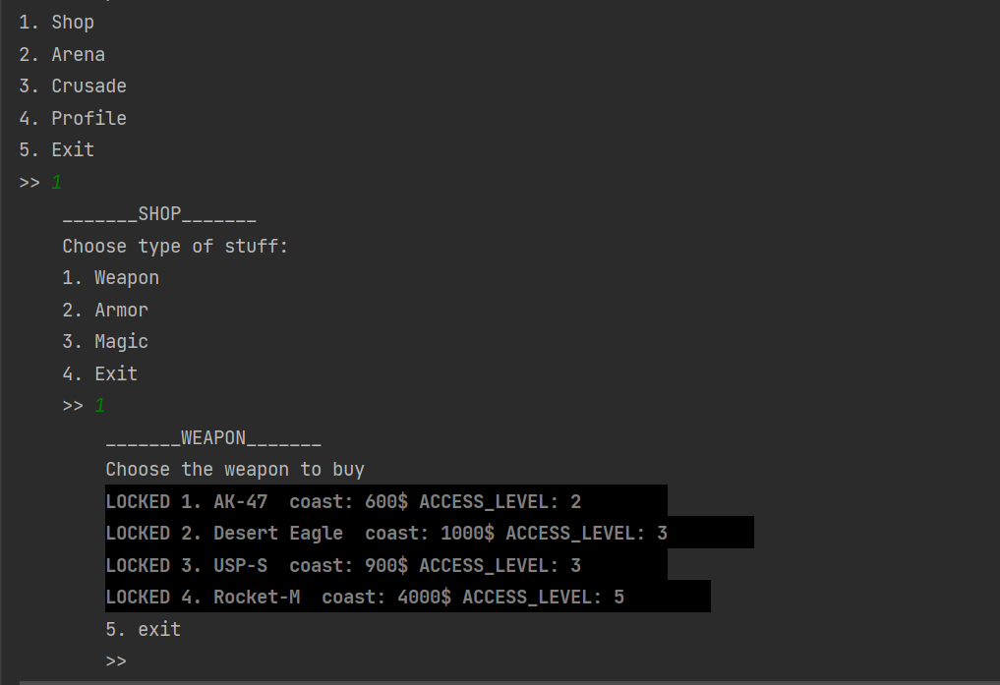

# Fighter-2D
This is my University project, which I made a little more interesting and user-friendly.
In this game you play as a hero.
##### Hero has :
  <ul>
    <li>Weapon</li>
    <li>4 Types of Armor</li>
    <ul>
      <li>Helmet</li>
      <li>Chest</li>
      <li>Leggs</li>
      <li>Boots</li>
    </ul>
    <li>3 Types of Magic</li>
    <ul>
      <li>Magic for Attack</li>
      <li>Magic for Defence</li>
      <li>Magic for equipment upgrade</li>
    </ul>
  </ul>

<br>

 <i>Enemies have the same properties</i>
 
 
 In the game you have access to the sections: <b>Shop</b>, <b>Arena</b>, <b>Crusade</b>, <b>Profile</b>.
 
 
 
 
### Arena & Crusade
The arena is a type of battle where the hero fights until he dies.
The level of enemies and their number increase after each battle.
<hr>
The crusade is a type of battle where the hero fights until he dies or enemies die.
<hr>

<h4> You can control the hero using the arrows on the keyboard.</h4>


  
  
### Profile
In the profile section you can see all information about your hero. Hero's items such as Armor elements, Weapons, Magic, health points, experience, level and ect.


  
  
### Shop
In the shop you can buy new equipment such as Armor, Weapon, Magic



---
<br>
<h2>CUSTOMISATION</h2>

<h4>In this program you can create your own map for a custom level. All you you to do this is fill array of symbols and mark the walls with a special symbol. </h4>

```java
        
        // '*' - wall
        
        String[] battleMap = {
                "******************************",
                "*                            *",
                "*                            *",
                "*                            *",
                "*     ******      ******     *",
                "*     ******      ******     *",
                "*     ******      ******     *",
                "*     ******      ******     *",
                "*     ******      ******     *",
                "*     ******      ******     *",
                "*     ******      ******     *",
                "*     ******      ******     *",
                "*     ******      ******     *",
                "*                            *",
                "*                            *",
                "*                            *",
                "*                            *",
                "*                            *",
                "*                            *",
                "******************************",
        };
```

<h4>In this program you can add any Equipment. Main class has ArrayList of these items.</h4> 

In method ` load[Equipment]Shop() ` you can add your custom item

```java
    public static void loadWeaponShop(){

        weaponList.add(new Weapon("AK-47", 47,  600, 2 ));
        ...
        ...
        ...

    }

```


  
